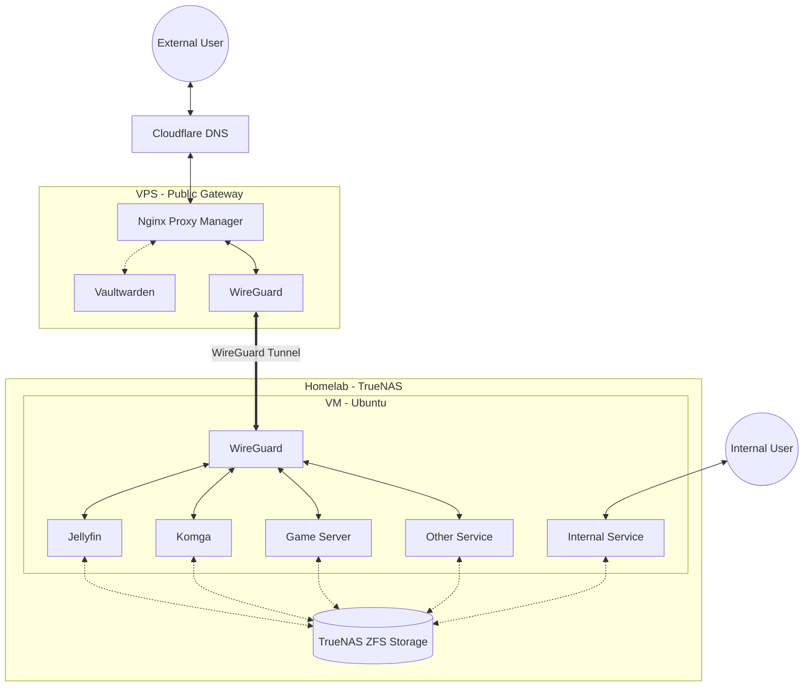

# Personal HomeLab & Infrastructure Documentation

## Executive Summary
This repository documents the architecture, hardware, and deployment strategy of my personal infrastructure. What began as a simple Ubuntu-based SMB server purely for storage has evolved into a hybrid cloud-to-on-premise environment powered by TrueNAS. The primary goal of this environment is to securely self-host personal document, media, run game servers, and maintain 24/7 availability for critical personal services while operating within a strict hardware budget.

## Hardware Evolution
I have incrementally upgraded the infrastructure to support heavier virtualization workloads and hardware acceleration.

| Component | Generation 1 (Original) | Generation 2 (Current) |
| :--- | :--- | :--- |
| **CPU** | Intel Core i3-10105 | Intel Core i5-11600KF |
| **RAM** | 32 GB | 64 GB |
| **GPU** | None (Integrated) | NVIDIA GTX 1650 |
| **Storage** | 4TB NAS-Grade HDD | 1TB SATA SSD + 4TB NAS-Grade HDD |
| **Host OS** | Ubuntu | TrueNAS Scale |

## Architecture & Networking
To bypass local ISP limitations (No port forward/Limited port) and ensure secure remote access, the architecture utilizes a hybrid approach by bridging a cloud VPS with the local TrueNAS host using Wireguard Tunnel.

* **DNS & Routing:** Cloudflare DNS records are utilized to manage subdomains and route traffic to the public-facing VPS.
* **Cloud Gateway (VPS):** A basic VPS acts as the ingress point. It hosts **Nginx Proxy Manager**, which handles all reverse proxy routing and HTTPS SSL certificate generation before traffic ever reaches the local network.
* **VPN Tunneling:** WireGuard is deployed to establish a persistent, secure tunnel between the VPS and the local Homelab VM with only specific port passed through. All web and game server traffic is routed through this tunnel.

## Storage & Compute Allocation
Storage is optimized for a balance of cost-efficiency and data security. 
* **Boot Storage:** To ensure reliability, TrueNAS OS is run in a separate 128GB SSD.
* **Primary Storage Pool:** Due to budget constraints, the primary data pool operates on a single server-grade 4TB HDD.
* **Secondary Storage Pool:** After upgrade, the Homelab now also manage a single consumer grade 1TB SATA SSD as the VM main storage and important data backup.
* **Access Control:** TrueNAS manages the storage pools with strict Access Control Lists (ACLs) configured for four distinct family users.
* **Virtualization:** A single, heavily provisioned Virtual Machine is allocated 70-80% of the host system's resources to run the Docker environment and game servers.

## Service Stack
Services are containerized using Docker and Docker Compose for portability and ease of management.

**Core Services (Homelab VM):**
* **Jellyfin:** Media streaming and management (utilizing the GTX 1650 for transcoding).
* **Komga:** E-book and comic reading server.
* **Beszel:** Homelab and VPS Monitoring website.
* **Wiregard:** A VPN Service used to tunnel specific network to VPS.
* **Game Servers:** Hosted instances (e.g., Minecraft), routed securely through the WireGuard tunnel and exposed via the VPS.

**Mission Critical & Gateway Services (VPS):**
* **Nginx Proxy Manager:** SSL termination and routing.
* **Beszel Agent:** A monitoring agent that send periodic data to Homelab.
* **Vaultwarden:** Deployed on the cloud VPS rather than the local lab to guarantee 24/7 uptime for password management.
* **Wiregard:** A VPN Service used to tunnel specific network to Homelab.

## Backup Strategy & Automation
Data redundancy and disaster recovery are automated across both cloud boundaries and internal storage pools.

* **Internal Redundancy:** To mitigate the risk of using a single primary HDD, critical data is automatically backed up (daily/weekly) from the HDD pool to a separate SSD data pool on the TrueNAS host.
* **Cloud-to-Local Sync:** Vaultwarden data is backed up daily from the VPS down to the local TrueNAS storage arrays.
* **Execution:** Synchronization is automated using `rsync` over the WireGuard tunnel, triggered reliably by `systemd` timers.

## Maintenance & Update Philosophy
* **Backups & Snapshot:** A periodic snapshot is created automatically daily and weekly with an expiring period of 2 weeks using TrueNAS build-in tools.
* **Storage Health Management:** To proactively monitor for hardware degradation, the following automated tasks are scheduled:
    * **ZFS Scrub/Trim:** Regular data integrity checks and SSD maintenance to prevent bit rot and maintain performance.
    * **S.M.A.R.T. Testing:** Periodic long and short self-tests to monitor drive telemetry and predict hardware failure before it occurs.
* **Auto Update:** While automation is used heavily for backups, container updates are explicitly handled manually. Tools like Watchtower are not utilized in this environment. This deliberate choice ensures that stable services do not break unexpectedly due to upstream image changes, prioritizing system reliability over bleeding-edge versioning.
